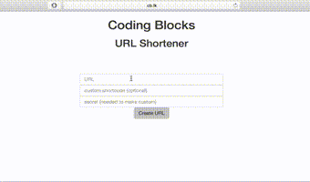

# shortlr

An URL shortening service written in **_express_**


## Getting Started

These instructions will get you a copy of the project up and running on your local machine for development and testing purposes. See deployment for notes on how to deploy the project on a live system.

### Prerequisites

* NodeJS
* Node Packet Manager(NPM)
* Git
* PostgreSQL


### Installing

A step by step series of examples that tell you have to get a development environment running

1. Download ZIP file or clone the repository to create your own copy.
```
git clone https://github.com/coding-blocks/shortlr
```
2. Move to the shortlr repository

```
cd ./shortlr
```
3. Install all project dependency packages via NPM

```
npm install
```
4. Set up PostgreSQL
 * If you don't have PostgreSQL setup on you machine you can download it from [here](https://www.postgresql.org/download/).
 
 * After Installation is complete create a new PostgreSQL user **shorturl** with password as **shorturl**.
 
 * Create a new database in PostgreSQL server with name **shorturl**.
 
5. Start the server.
  ```
  npm start
  ```
  And see it working on port 4000. 
  
## Authors
* Arnav Gupta -- [championswimmer](https://github.com/championswimmer)

See also the list of [contributors](https://github.com/coding-blocks/shortlr/graphs/contributors) who are participating in this project.


### Demo




[](https://nodei.co/npm/shortlr/)


